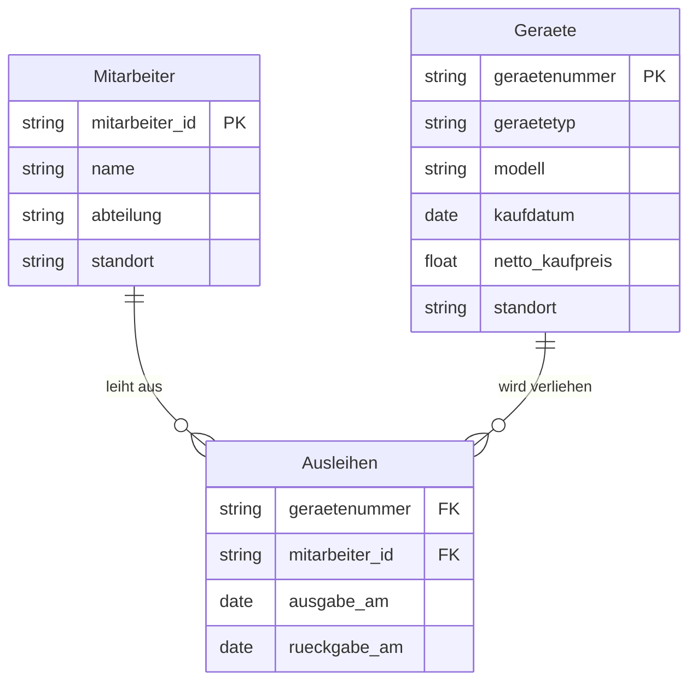

**R1**: Jedes Gerät darf nur eine Aktive zuweisung haben.  
**R2**: Wenn ein Gerät ausgeliehen wird muss ein Rückgabedatum erstellt werden.  
**R3**: Ein Gerät darf nur eine ID haben und diese kann erst nach dem rückgabedatum wieder ausgeliehen werden.  
**R4**: Der Preis darf nicht negativ sein.
